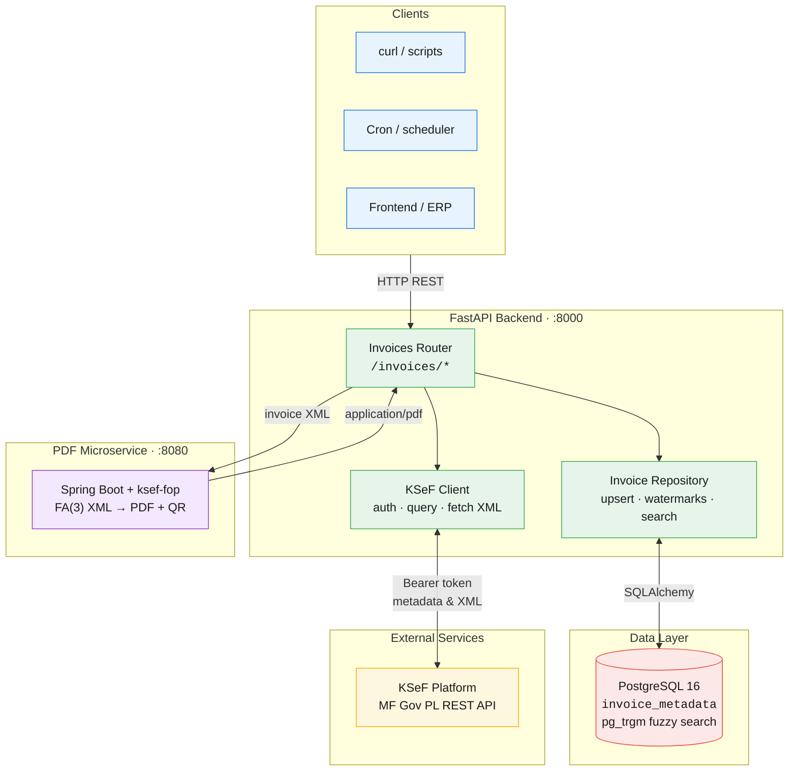
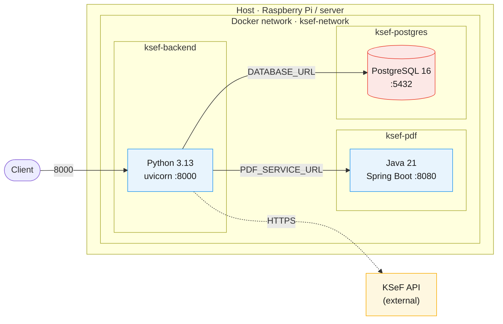
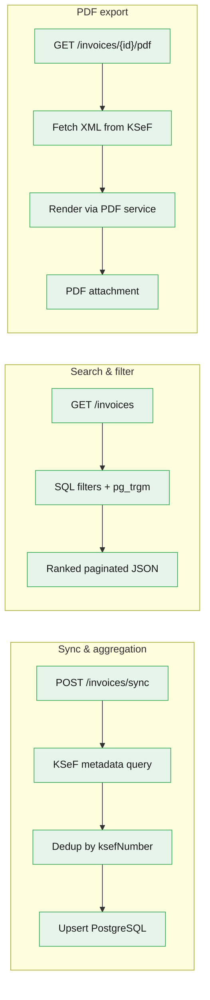
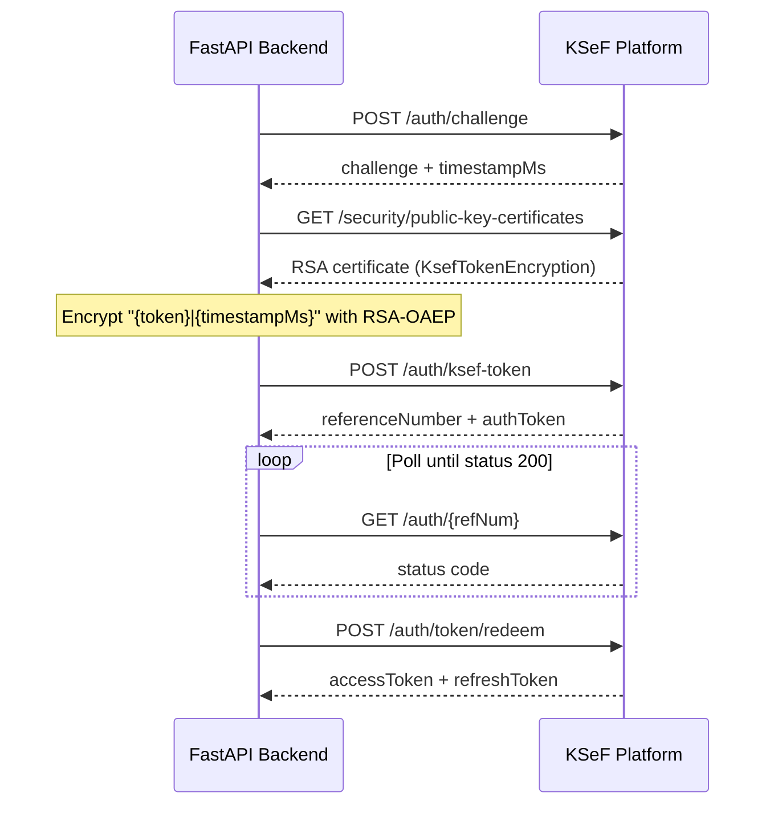
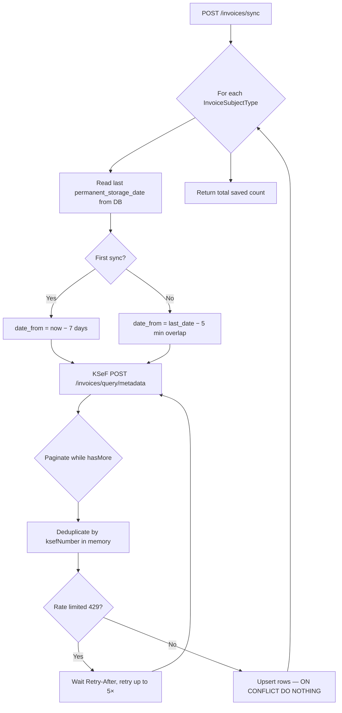
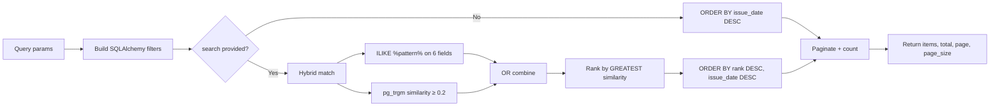
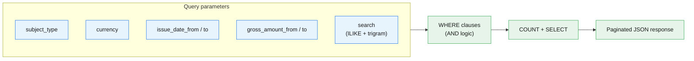
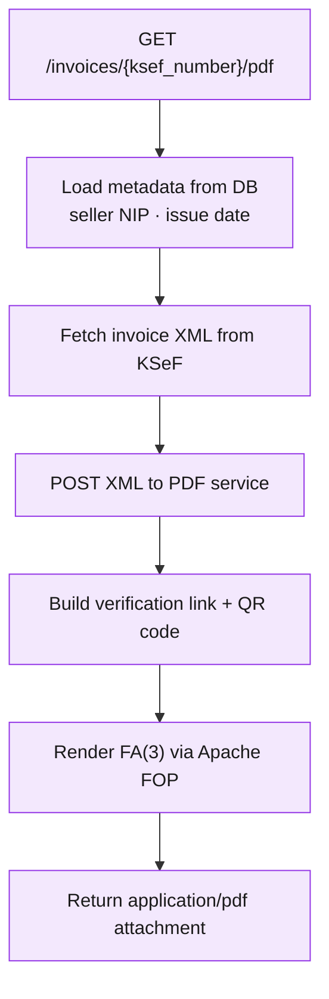

# KSeF API

[](https://www.python.org/)
[](https://fastapi.tiangolo.com/)
[](https://www.postgresql.org/)
[](https://openjdk.org/)
[](https://spring.io/projects/spring-boot)
[](https://docs.docker.com/compose/)
[](https://github.com/FalconDevX/ksef_api/actions/workflows/deploy.yml)
[](#)

A self-hosted integration layer for the Polish **KSeF** (Krajowy System e-Faktur) e-invoicing platform. The service synchronizes invoice metadata from KSeF into a local PostgreSQL store, exposes a rich search and filtering API with fuzzy matching, and generates downloadable PDF invoices with verification QR codes.

---

## Table of Contents

- [Architecture Overview](#architecture-overview)
- [End-to-End Flows](#end-to-end-flows)
  - [Authentication Flow](#authentication-flow)
  - [Invoice Sync & Aggregation Flow](#invoice-sync--aggregation-flow)
  - [Search, Filter & Fuzzy Matching Flow](#search-filter--fuzzy-matching-flow)
  - [PDF Generation Flow](#pdf-generation-flow)
- [Key Features](#key-features)
  - [Metadata Aggregation](#metadata-aggregation)
  - [Fuzzy Search & Advanced Filtering](#fuzzy-search--advanced-filtering)
- [API Reference](#api-reference)
- [Tech Stack](#tech-stack)
- [Getting Started](#getting-started)
- [Configuration](#configuration)
- [Deployment](#deployment)
- [Planned Improvements](#planned-improvements)

---

## Architecture Overview

### High-level system



### Docker Compose topology



### Request paths by feature



The system is split into three Docker services:

| Service | Role |
|---------|------|
| **backend** | FastAPI app — KSeF auth, sync, search, XML/PDF proxy |
| **pdf** | Java Spring Boot service — FA(3) XML → PDF with KSeF verification QR |
| **postgres** | Persistent store for aggregated invoice metadata |

---

## End-to-End Flows

### Authentication Flow

Every KSeF-facing request obtains a fresh access token through the challenge–response flow:



The encrypted token is built in `app/ksef/crypto.py` using the official KSeF public certificate. Tokens are currently redeemed per request; see [Planned Improvements](#planned-improvements) for token caching.

---

### Invoice Sync & Aggregation Flow

The sync endpoint (`POST /invoices/sync`) incrementally pulls metadata from KSeF and stores it locally. Aggregation happens at two levels:

1. **Per subject type** — paginated KSeF queries with in-memory deduplication by `ksefNumber`.
2. **Cross-subject** — the live metadata endpoint merges results from all configured subject types into a single deduplicated list.



**Incremental sync strategy**

| Aspect | Behavior |
|--------|----------|
| Watermark | `MAX(permanent_storage_date)` per `subject_type` |
| Overlap window | 5 minutes — prevents gaps from clock skew or late indexing |
| Cold start | Last 7 days when no local data exists |
| Idempotency | `INSERT … ON CONFLICT DO NOTHING` on `ksef_number` PK |
| Rate limits | Respects KSeF `429` + `Retry-After` header |

**Subject types** (KSeF perspective roles):

| Enum value | Meaning |
|------------|---------|
| `Subject1` | Issuer (seller) |
| `Subject2` | Buyer |
| `Subject3` | Third party |
| `SubjectAuthorized` | Authorized entity |

The sync loop iterates all four types. The live KSeF client currently queries `Subject2` only; enabling the remaining types is a planned improvement.

---

### Search, Filter & Fuzzy Matching Flow

The list endpoint (`GET /invoices`) reads from the local PostgreSQL cache — no KSeF round-trip — and applies structured filters plus optional fuzzy search.



**Filter pipeline (all combinable with AND logic):**



---

### PDF Generation Flow



---

## Key Features

### Metadata Aggregation

The aggregation layer solves a core KSeF integration problem: a single invoice can appear under multiple subject perspectives, and the API returns paginated, subject-scoped result sets.

**What the service aggregates:**

- **Cross-page deduplication** — while paginating KSeF responses, invoices are stored in a `dict[ksefNumber → invoice]` to avoid duplicates within a sync window.
- **Cross-subject deduplication** — `get_all_invoices_metadata()` merges Subject1–SubjectAuthorized results into one list keyed by `ksefNumber`.
- **Persistent local cache** — synced metadata lives in `invoice_metadata`, enabling fast queries without hitting KSeF rate limits.
- **Rich normalized schema** — seller/buyer identifiers, amounts (net/gross/VAT), form codes, invoicing mode, hash, and timestamps are mapped from raw KSeF JSON into typed SQLModel columns.

**Stored fields (selection):**

| Column | Source |
|--------|--------|
| `ksef_number` | Primary key |
| `subject_type` | Sync context (Subject1–SubjectAuthorized) |
| `invoice_number`, `issue_date` | Core invoice identity |
| `permanent_storage_date` | Incremental sync watermark |
| `seller_nip`, `seller_name` | Seller party |
| `buyer_identifier_*`, `buyer_name` | Buyer party |
| `net_amount`, `gross_amount`, `vat_amount`, `currency` | Financials |
| `invoice_hash` | Integrity reference from KSeF |

---

### Fuzzy Search & Advanced Filtering

Search is designed for real-world invoice lookup where users may mistype names, remember partial numbers, or search across multiple party fields at once.

**Hybrid matching strategy**

When the `search` query parameter is provided (2–100 characters), the backend combines two PostgreSQL techniques:

| Technique | Purpose | Fields |
|-----------|---------|--------|
| `ILIKE '%term%'` | Exact substring match | `invoice_number`, `ksef_number`, `seller_nip`, `seller_name`, `buyer_identifier_value`, `buyer_name` |
| `similarity(col, term) >= 0.2` | Trigram fuzzy match | `invoice_number`, `seller_name`, `buyer_name` |

A row matches if **either** strategy succeeds (OR logic). This means `"ACME"` finds exact substrings instantly, while `"ACME Corparation"` (typo) can still match `"ACME Corporation"` via trigrams.

**Relevance ranking**

Matched rows are ordered by the highest trigram similarity across four fields:

```sql
GREATEST(
  similarity(invoice_number, :search),
  similarity(seller_name,    :search),
  similarity(buyer_name,     :search),
  similarity(ksef_number,    :search)
) DESC, issue_date DESC
```

**Structured filters (composable with search):**

| Parameter | Type | Description |
|-----------|------|-------------|
| `subject_type` | enum | Filter by KSeF subject perspective |
| `currency` | string (3) | ISO currency code, e.g. `PLN` |
| `issue_date_from` / `issue_date_to` | date | Inclusive issue date range |
| `gross_amount_from` / `gross_amount_to` | decimal | Inclusive gross amount range |
| `page` / `page_size` | int | Pagination (default 20, max 100) |

**Example queries:**

```bash
# Fuzzy search by seller name fragment
curl "http://localhost:8000/invoices?search=nowak&page=1&page_size=20"

# Filter PLN invoices from Q1 2026 above 10 000 PLN gross
curl "http://localhost:8000/invoices?currency=PLN&issue_date_from=2026-01-01&issue_date_to=2026-03-31&gross_amount_from=10000"

# Combine fuzzy search with subject type
curl "http://localhost:8000/invoices?search=FV/2026&subject_type=Subject2"
```

> **PostgreSQL requirement:** Fuzzy search relies on the `pg_trgm` extension (`CREATE EXTENSION pg_trgm;`). Enable it once on your database before using similarity functions.

---

## API Reference

| Method | Endpoint | Description |
|--------|----------|-------------|
| `POST` | `/invoices/sync` | Incremental sync from KSeF → PostgreSQL |
| `GET` | `/invoices` | Paginated list with filters + fuzzy search |
| `GET` | `/invoices/metadata` | Live KSeF metadata (all subjects, deduplicated) |
| `GET` | `/invoices/{ksef_number}` | Download invoice XML from KSeF |
| `GET` | `/invoices/{ksef_number}/pdf` | Generate and download PDF with QR code |

Interactive OpenAPI docs are available at `/docs` when the backend is running.

---

## Tech Stack

| Layer | Technology |
|-------|------------|
| API | Python 3.13, FastAPI, SQLModel, SQLAlchemy 2 |
| Database | PostgreSQL 16, `pg_trgm` for fuzzy search |
| KSeF integration | `requests`, RSA-OAEP token encryption (`cryptography`) |
| PDF rendering | Java 21, Spring Boot 3.5, [ksef-fop](https://github.com/alapierre/ksef-fop) |
| Containerization | Docker, Docker Compose |
| CI/CD | GitHub Actions → self-hosted ARM64 runner (Raspberry Pi) |

---

## Getting Started

### Prerequisites

- Docker & Docker Compose
- A KSeF token and NIP registered in the KSeF environment
- External Docker network `ksef-network` (created once):

```bash
docker network create ksef-network
```

### Setup

1. Clone the repository:

```bash
git clone https://github.com/FalconDevX/ksef_api.git
cd ksef_api
```

2. Create `.env` in the project root:

```env
KSEF_TOKEN=your-ksef-token
KSEF_NIP=1234567890
KSEF_BASE_URL=https://api-test.ksef.mf.gov.pl/v2
POSTGRES_PASSWORD=strong-password-here
KSEF_QR_BASE_URL=https://qr-test.ksef.mf.gov.pl
```

3. Enable PostgreSQL trigram extension (first run):

```bash
docker compose up -d postgres
docker exec -it ksef-postgres psql -U ksef_user -d ksef -c "CREATE EXTENSION IF NOT EXISTS pg_trgm;"
```

4. Start all services:

```bash
docker compose up -d --build
```

5. Trigger initial sync:

```bash
curl -X POST http://localhost:8000/invoices/sync
```

6. Search invoices:

```bash
curl "http://localhost:8000/invoices?search=example&page=1"
```

---

## Configuration

| Variable | Required | Default | Description |
|----------|----------|---------|-------------|
| `KSEF_TOKEN` | yes | — | KSeF authentication token |
| `KSEF_NIP` | yes | — | Company NIP (tax ID) |
| `KSEF_BASE_URL` | yes | — | KSeF API base URL (test or production) |
| `DATABASE_URL` | yes* | set in compose | SQLAlchemy connection string |
| `PDF_SERVICE_URL` | no | `http://ksef-pdf:8080` | Internal PDF service URL |
| `KSEF_QR_BASE_URL` | no | `https://qr-test.ksef.mf.gov.pl` | QR verification base URL |
| `POSTGRES_PASSWORD` | yes | — | PostgreSQL password (compose) |

\* Overridden by Docker Compose to point at the `postgres` service.

---

## Deployment

Pushes to `main` trigger an automated deployment via GitHub Actions on a self-hosted ARM64 runner (Raspberry Pi):

1. `git pull --ff-only origin main`
2. `docker compose build pdf backend`
3. `docker compose up -d --remove-orphans`
4. Prune unused Docker images

See [`.github/workflows/deploy.yml`](.github/workflows/deploy.yml) for the full pipeline.

---

## Planned Improvements

The following enhancements are on the roadmap:

### Aggregation & Sync

- [ ] **Enable all subject types** — activate Subject1, Subject3, and SubjectAuthorized in the KSeF client (currently only Subject2 is queried live).
- [ ] **Scheduled background sync** — cron or APScheduler job instead of manual `POST /invoices/sync`.
- [ ] **Financial aggregation endpoints** — `/invoices/stats` with grouped sums (by month, seller, currency, VAT rate).
- [ ] **Sync status & observability** — last sync timestamp, per-subject counters, error log endpoint.
- [ ] **Remove per-subject fetch cap** — make `MAX_INVOICES_PER_SUBJECT` configurable for large backfills.

### Search & Filtering

- [ ] **GIN trigram indexes** — `CREATE INDEX … USING gin (seller_name gin_trgm_ops)` for faster fuzzy queries at scale.
- [ ] **Configurable similarity threshold** — expose `min_similarity` as a query parameter (currently hardcoded at `0.2`).
- [ ] **Multi-field weighted ranking** — boost `invoice_number` and `ksef_number` matches over party names.
- [ ] **Saved filter presets** — named search profiles for common business queries (e.g. "unpaid PLN this month").
- [ ] **Full-text search (`tsvector`)** — complement trigrams with PostgreSQL FTS for longer text fields and attachment metadata.

### Platform & Reliability

- [ ] **Token refresh caching** — reuse `accessToken` until `validUntil` instead of full auth on every request.
- [ ] **Database migrations** — Alembic setup with `pg_trgm` extension baked into initial migration.
- [ ] **API authentication** — protect endpoints with API keys or OAuth2 for production use.
- [ ] **Automated tests** — unit tests for search/filter logic, integration tests against KSeF sandbox.
- [ ] **Health checks** — `/health` aggregating backend, PostgreSQL, PDF service, and KSeF connectivity.
- [ ] **Production KSeF environment** — configuration profile switch for test vs. production endpoints and QR URLs.

---

## Project Structure

```
ksef_api/
├── app/
│   ├── main.py                 # FastAPI entry point
│   ├── config.py               # Pydantic settings
│   ├── database.py             # SQLAlchemy engine & session
│   ├── ksef/
│   │   ├── client.py           # KSeF authentication
│   │   ├── crypto.py           # RSA-OAEP token encryption
│   │   └── invoices.py         # Metadata query & XML fetch
│   ├── models/
│   │   └── invoice.py          # InvoiceMetadata SQLModel
│   ├── repositories/
│   │   └── invoices.py         # Upsert & watermark queries
│   └── routers/
│       └── invoices.py         # HTTP endpoints (sync, search, PDF)
├── ksef-pdf-service/           # Java Spring Boot PDF microservice
├── docker-compose.yml
├── Dockerfile
└── .github/workflows/deploy.yml
```

---

## License

Private — all rights reserved.
